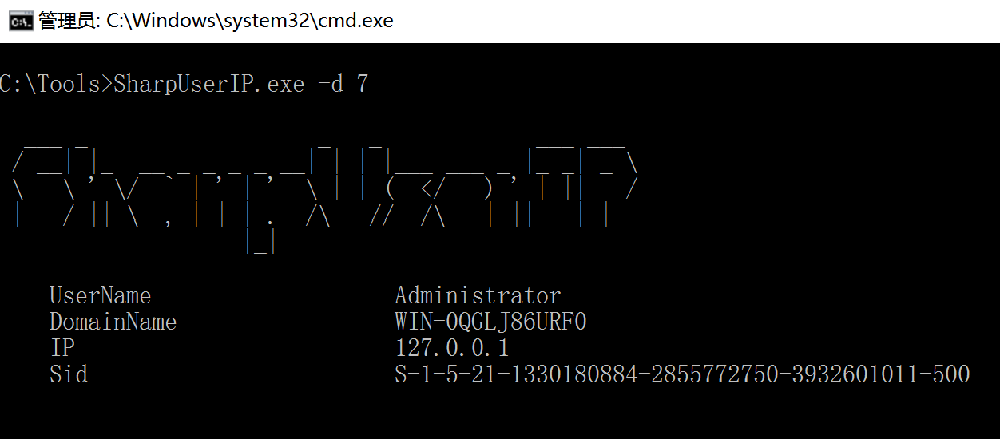
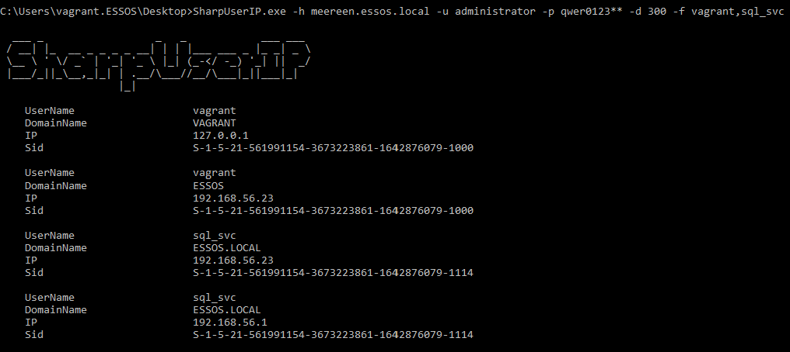

# SharpUserIP

## 功能简介

- 服务器登陆日志 (需管理员权限)
- 在域控或远程提取登录日志，快速获取域用户对应的 IP 地址
- 项目地址：https://github.com/lele8/SharpUserIP


## 使用说明

```
  ___ _                  _   _            ___ ___
 / __| |_  __ _ _ _ _ __| | | |___ ___ _ |_ _| _ \
 \__ \ ' \/ _` | '_| '_ \ |_| (_-</ -_) '_| ||  _/
 |___/_||_\__,_|_| | .__/\___//__/\___|_||___|_|
                   |_|


Get the log of successful login or the specified user
By @lele

  -H             Specify the machine IP or machine name
  -U             Administrator account name
  -P             Administrator account password
  -D             Specify the time range (days) for enumeration
  -F             Enumerate specified users
  -O             Path to save the result, by default save to the log.txt of the current path
  -All           Get logs from all domain controllers

  Usage:
       SharpUserIP.exe -d 7
       SharpUserIP.exe -h ip -d 7
       SharpUserIP.exe -h ip -d 7 -f user1,user2
       SharpUserIP.exe -h ip -u username -p password -d 7
       SharpUserIP.exe -h ip -u username -p password -d 7 -all
       SharpUserIP.exe -h ip -u username -p password -d 7 -f user -o C:\path\result.txt
```

服务器获取日志:



域内远程获取日志:



## 免责声明

本工具仅面向**合法授权**的企业安全建设行为，如您需要测试本工具的可用性，请自行搭建靶机环境。

在使用本工具时，您应确保该行为符合当地的法律法规，并且已经取得了足够的授权。**请勿对非授权目标进行扫描。**

如您在使用本工具的过程中存在任何非法行为，您需自行承担相应后果，作者将不承担任何法律及连带责任。

在安装并使用本工具前，请您**务必审慎阅读、充分理解各条款内容**，限制、免责条款或者其他涉及您重大权益的条款可能会以加粗、加下划线等形式提示您重点注意。 除非您已充分阅读、完全理解并接受本协议所有条款，否则，请您不要安装并使用本工具。您的使用行为或者您以其他任何明示或者默示方式表示接受本协议的，即视为您已阅读并同意本协议的约束。

## 更新日志

- 支持 .Net Framework 3.5 , 4.0
